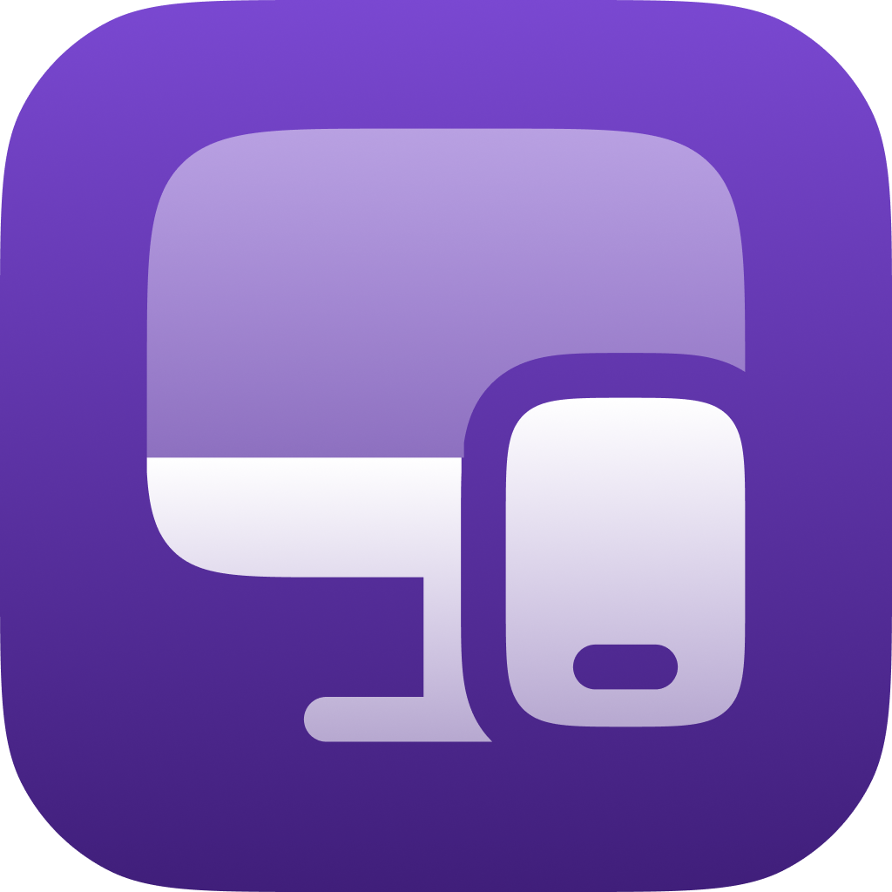

# AuraSync | UI Package

AuraSync connects your Android to your PC or Mac for remote control, mirroring
and real-time data exchange via USB or local network.

## 🧑‍💻 Technologies

* [Dart](https://dart.dev/)
* [Flutter](https://flutter.dev/)

## 🖥️ Platforms

* Linux(snap) ✅
* macOS(>=11.5) ✅
* Windows(>=10.0) ✅
* Android(>=5.1|SDK22) ✅

## 📜 Credits

* SoftYes TI [\<softyes.com.br\>](https://softyes.com.br)
* João Sereia [\<joao.sereia@softyes.com.br\>](mailto:joao.sereia@softyes.com.br)
